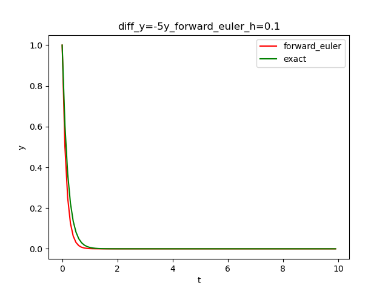
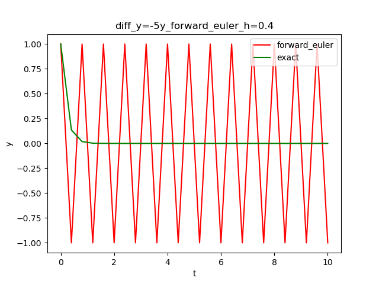
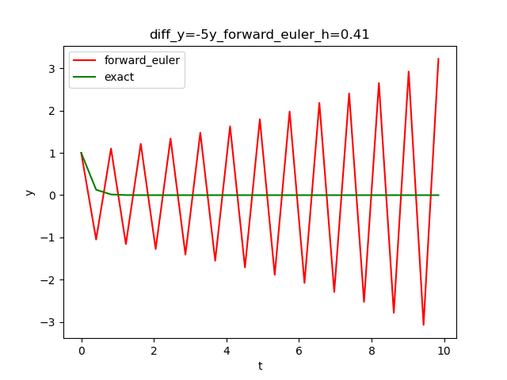
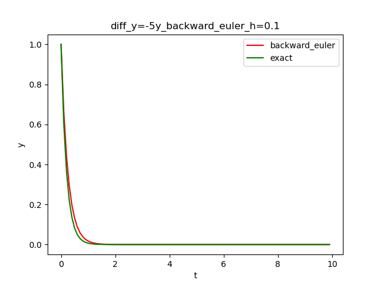
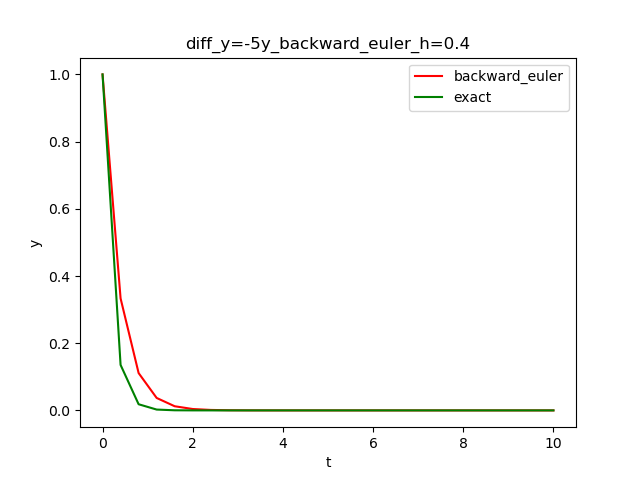
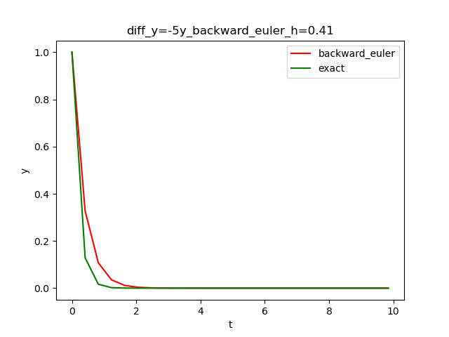
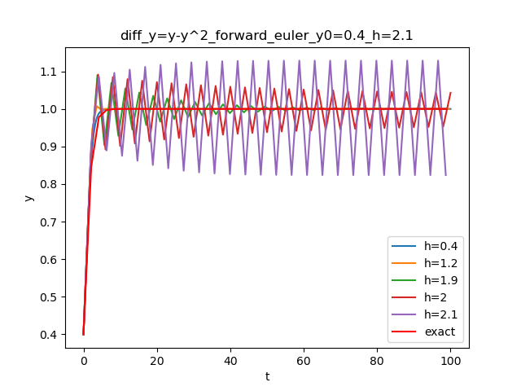
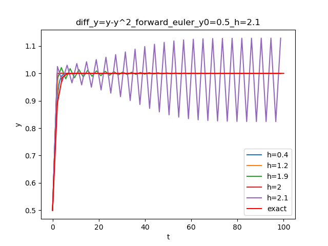
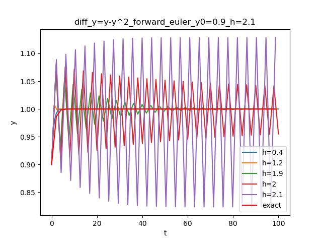

### Problem 1

#### Result
|  | h=0.1 | h=0.4 | 0.41 |
| ---- | ---- | ---- | ---- |
| forward_euler |  |  |  |
| backward_euler |  |  |  |

#### Explanation
From lecture [note](https://hackmd.io/@teshenglin/SCMA30009_05#The-absolute-stability), we know for the form $y'=\lambda y$, where $y(0)=1$
- for forward euler method, for $h < \frac{-2Real(\lambda)}{|\lambda|}$ it is absolute stable, therefore, $h < 0.4$ in this case
    - For $h = 0.4$, it brings $u_n = (1+\lambda h)u_0 = (-1)^n$, therefore, the value jump between 1 and -1.
- for backward euler method, it is unconditionally stable as $\lambda = -5$ is a real number.

The programming result matches the analysis.

### Problem 2

#### Result
|  | forward_euler |
| ---- | ---- |
| y0=0.4 |  |
| y0=0.5 |  |
| y0=0.9 |  |

#### Result and Observation
For $h \in (0, 2)$, it brings qualitatively correct.
For $h = 2$, it could convergent or divergent with different y0 settings (convergent when $y_0=0.5$ and divergent when $y_0=0.4, 0.9$ in my setup). Moreover, if $y0*h = 1$, which means the $y_1$ will touch the convergence value right after the first step, and it will stay on it forever.

#### Explanation
It is a nonlinear ODE, with equilibrium points at $y^{*} = 0$ (unstable) and $y^{*} = 1$ (stable).
So consider $y^{*} = 1$, and get $\lambda = y^{*} = -1$, so it requires $|1-\lambda h|<1 \implies 0 < h < 2$ for stability near the point.